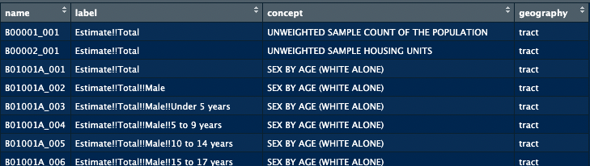

# census-tract-redistricting

This branch (WIP) contains scripts for downloading US Census data from multiple years at the census tract level and converting data from previous years' tracts to current tracts based on area overlap. The code in this branch is entirely different from main, as this portion of the original repo was basically not started yet.

* *Currently supported years*: 2010-2020 (i.e. converts any tract data from 2010-2019 to 2020 tracts)
* Might extend support back to earlier years if USCB provides the necessary files (like [these](https://www2.census.gov/geo/docs/maps-data/data/rel2020/tract/) for 2010-2020)

```bash 
├── README.md
├── config.yaml
├── example-use-notebook.ipynb
├── tract_crosswalk.py
├── main.py
├── logger.py
├── utils.py
└── requirements.txt
```

#### *config.yaml*

Set all download parameters in this file.

```yaml
data_dir: 'data' # Where you want to download/store your files; will be created if it doesn't exist.

tract_crosswalk:  
  overlap_precision: 3  # How many decimals' precision you want when calculating the tract geom overlaps. Default=3.
  overwrite_azure: True # Whether to overwrite a crosswalk file of the same name in the specified Azure container. 
  overwrite_local: True # Whether to overwrite any local copies of a crosswalk file with the same name. 

api-info: 
  azure: 
    connection-str: #  
    container-name: 
    storage-acct-name: pipelinemapping
  census: 
    key: f22243111b808d4b0553207cefbc32b380a09b52
census_vars: [] # give list of census variables which you want to download 
start_year:
end_year: 
states: ['All'] # ['All'] or custom list of states (names, fips, or USPS accepted)

```

To find the Azure connection string and container name, search for the storage account `pipelinemapping` in our Azure blob storage and search for access keys in the sidebar as pictured: 

*[How to find Connection String](https://stackoverflow.com/questions/2338650/connection-string-to-an-azure-cloud-storage-account)* (valid as of 12/12/2023)


* (If this storage location is ever deleted or moved at some point, you can just create a new storage account and container in Azure and add those names + the connection string to `config.yaml` instead. Please update the name of the storage account in this README.md if you do so.)

Sign up for a Census API Key [here](https://api.census.gov/data/key_signup.html). 

#### *main.py*
Downloads tract-level data from the US Census API and uses the crosswalk file to map data from past-years tracts to current-year tracts. Specify desired census variables, states, and years in `config.yaml`.

#### *tract_crosswalk.py*
Downloads the tract area crosswalk (it's run already in `main.py` so no need to run this separately)., 

The USCB has [files](https://www2.census.gov/geo/docs/maps-data/data/rel2020/tract/) explaining which tracts from 2010 overlap with tracts from 2020, but it does not state how much the tracts overlap. So while this file is essential to narrow down the amount of calculations we need to do, we still need to calculate the overlaps ourselves.

* If the complete crosswalk file exists in Azure and `overwrite_azure: False`, the script will download it from there rather than re-producing it from scratch.  
* If re-producing the file, the script will upload to the provided Azure container. 
* Currently the script will not run unless a valid Azure container is provided (this is intentional for team version control).


#### Other points 

To identify census variables, I recommend using the R package ['tidycensus'](https://walker-data.com/tidycensus/) and its ['load_variables'](https://walker-data.com/tidycensus/reference/load_variables.html) function. The View panel in R Studio makes searching far better than with pygris in VS Code -- it 100% worth installing solely for this QOL feature.

```r 
# example code snippet 
acs_variables <- load_variables(2019, "acs5")
View(acs_variables)
```




Note that in pygris you need to add "E" to the end of ACS variables (e.g. 'B00001_001' should be 'B00001_001E')